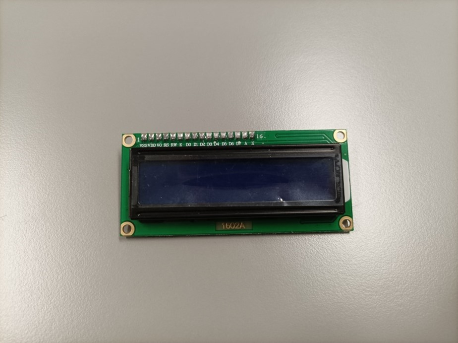
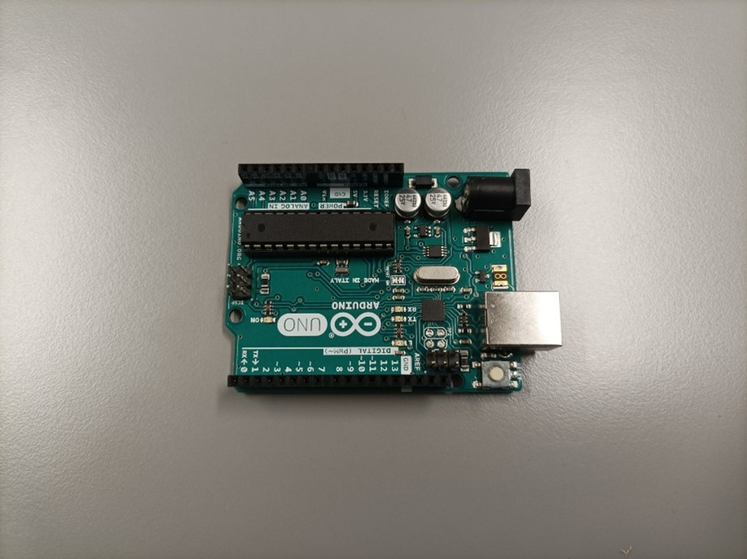
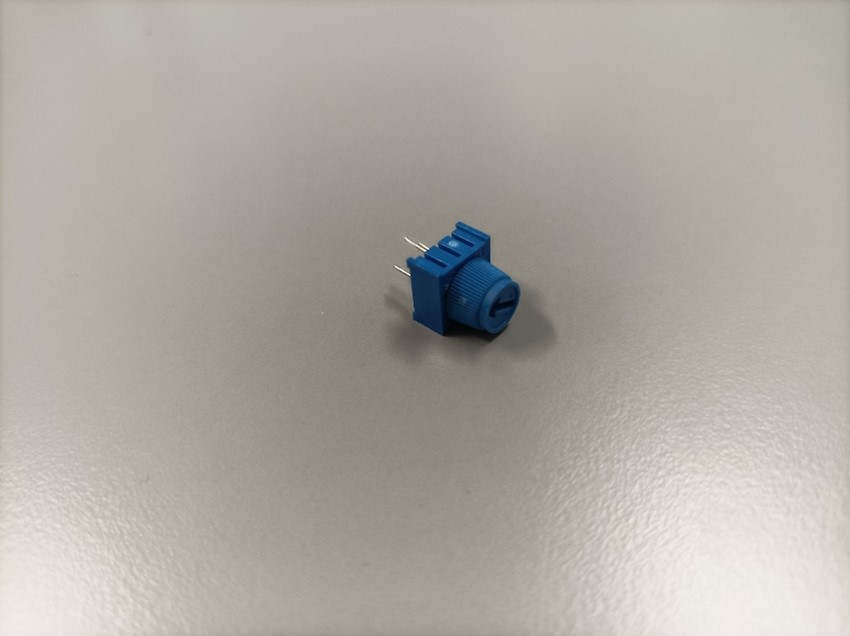
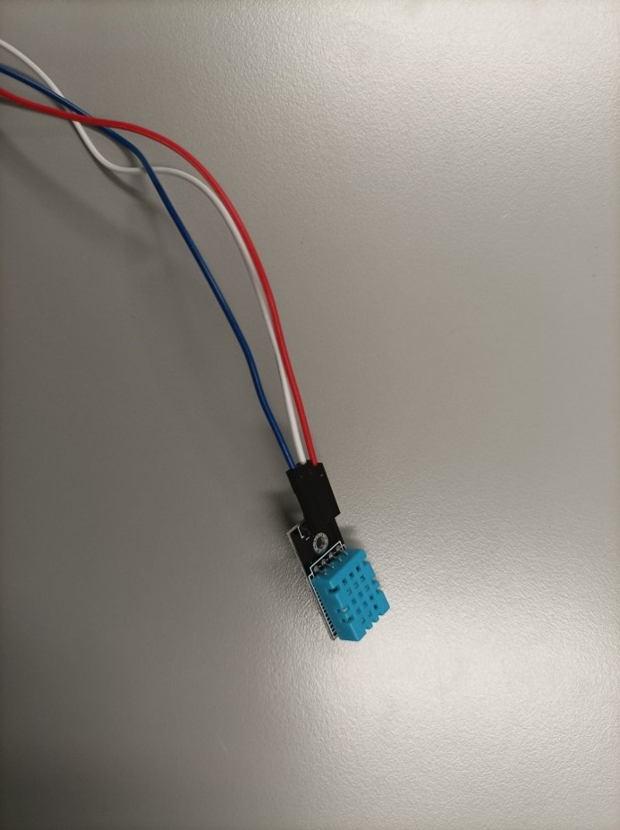
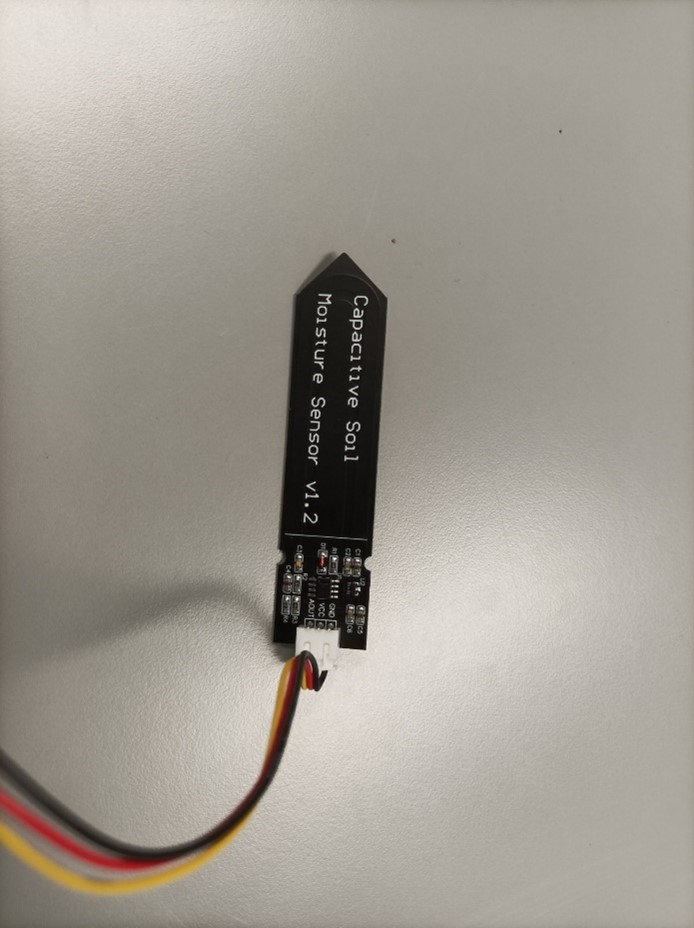
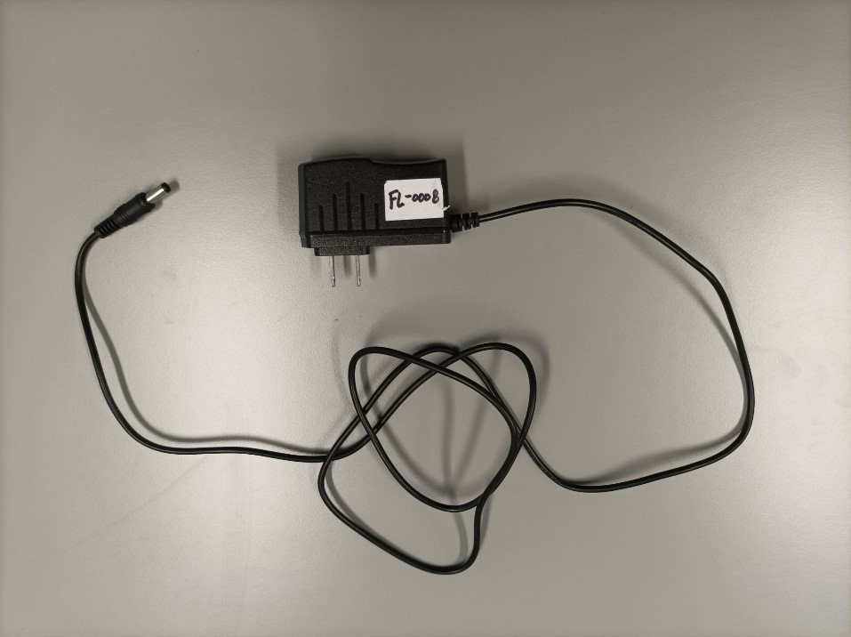
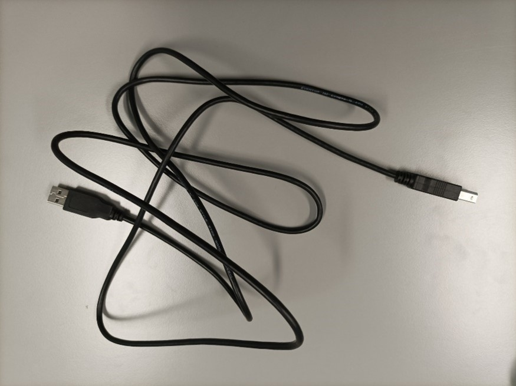
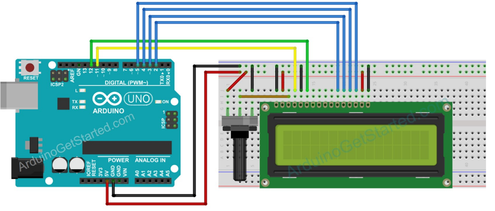
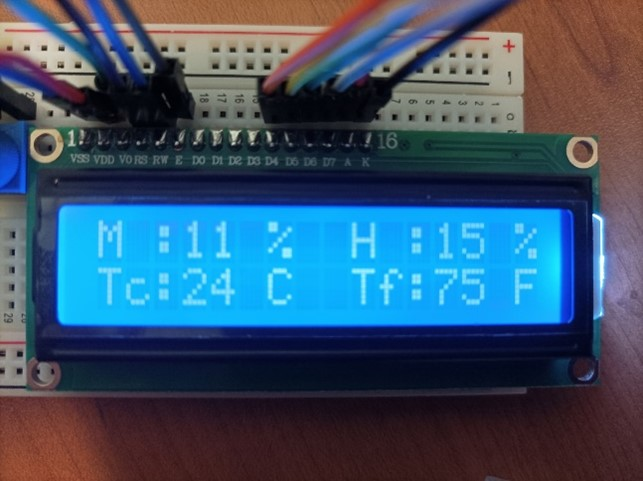
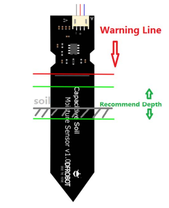

# Sommaire <!-- omit in toc -->


# Capteurs, écran LCD et Arduino

Ce document a pour but de résumé et expliquer les différentes étapes nécessaires pour utiliser un capteur d’humidité, de température, d’humidité des sols, un écran LCD et un arduino UNO.

Matériel nécessaire :
-	Ecran LCD <br/> 
 
-	Arduino uno <br/> 
 
-	Potentiomètre <br/> 
 
-	Jumper wires 

-	Capteur d’humidité et de température <br/> 
 
-	Capteur d’humidité des sols <br/> 
 
-	Alimentation 5V <br/> 
 
-	Cable USB vers USB type B <br/> 
 
-	Breadboard

__**Prérequis**__ :
Avoir téléchargé et installé l’IDE d’arduino.

# Branchements 
L’écran LCD étant la partie la plus complexe de l‘installation et des branchements nous allons
commencer par cela. Branchez les différents éléments comme l’image ci-dessous (la couleur des jumper
wires n’a aucune importance mais il est conseillé de s’imposer un code couleur pour mieux se
retrouver dans les branchements, par exemple des câbles rouges pour le signe + et des câbles noirs
pour le -) :


 
Quand cela est fait nous pouvons passer au branchement des capteurs. Commençons par le capteur de température et d’humidité. Connecté la tige + du capteur à la bande + de votre bread board et la tige – à la bande – de votre bread board. Pour la tige restante connecté la au pin 8 de votre arduino. En ce qui concerne le capteur d’humidité des sols, réitéré le même type de branchement que l’autre capteur pour la borne + et – (si vous ne voyez pas de + ou de – sur le capteur connecté le câble rouge au + et le noir au -). Le dernier câble doit être connecté au pin A0 de votre arduino.

# Code et lancement du système :
Connectez votre arduino à votre ordinateur grâce au câble USB vers USB type B. Avant de faire quoi que ce soit regarder si votre écran LCD s’allume, si ce n’est pas le cas vous vous êtes trompé dans les branchements notamment au niveau de l’alimentation de l’écran LCD. Ensuite téléchargez le code disponible à cette [adresse](https://drive.google.com/drive/folders/1XI4GdzArzSmXVJ9uGre2PRAiJkumBldT?usp=sharing) .

Ensuite ouvrez-le dans l’IDE d’arduino. Enfin téléverser le fichier vers votre arduino. Si tous vos branchements sont corrects l’écran devrait vous afficher la température en °C et °F et l’humidité de l’air et des sols en % (Si rien ne s’affiche essayer de tourner le potentiomètre dans un sens et dans l’autre pour modifier le contraste de l’écran, si rien ne se passe vérifier les branchements). Notez que dans le code certaines valeurs doivent être changé si vous avez modifié les certains branchements (Les branchement que je propose fonctionne d’autres branchements pourraient être corrects théoriquement mais pourraient ne pas fonctionnés).

# Explication du code
```Arduino
#define DHTPIN 8 // Digital pin connected to the DHT  sensor
```

Cette variable représente le port auquel est brancher le câble de donnée de votre capteur de
température et d’humidité.
____
```Arduino
#define DHTTYPE DHT11   // DHT 11
//#define DHTTYPE DHT22   // DHT 22  (AM2302), AM2321
//#define DHTTYPE DHT21   // DHT 21 (AM2301)
```
 
Décommentez la ligne qui correspond à la version de votre capteur de température et d’humidité.
 
____
```Arduino
LiquidCrystal lcd(11, 12, 2, 3, 4, 5);
```

Les différents nombres entre parenthèse représentent les différents ports auxquelles sont branché
les câbles de votre écran LCD, sur le support de votre écran LCD des inscriptions sont normalement
marqués pour chaque pin de l’écran, ils indiquent la fonction de chaque pin. Voici la correspondance
entre les nombres entre parenthèse et les pin de l’écran auxquelles sont branchés les ports de
l’arduino : `lcd(RS, E, D4, D5, D6, D7)`

____
```Arduino
float m = analogRead(A0);
```
 
A0 représente le port auquel est brancher le câble de donnée de votre capteur de d’humidité des sols.
 
# Résultats 
Les résultats qui sont affiché doivent ressembler à ceci :


 
Tc indique la température en Celsius. <br/>
Tf indique la température en Fahrenheit. <br/>
H indique le taux d’humidité dans l’air. <br/>
M indique le taux d’humidité des sols. <br/>
Pour ce dernier regardons l’échelle d’humidité pour le jardinage :
-	De 0% à 35% la terre est sèche et à besoin d’être hydraté.
-	De 36% à 65% la terre est bien hydratée.
-	De 66% à 100% la terre est gorgée d’eau.

Attention le résultat du capteur d’humidité des sols n’a aucune sorte de valeur à l’air libre. Il
doit être utilisé de cette façon :


 
