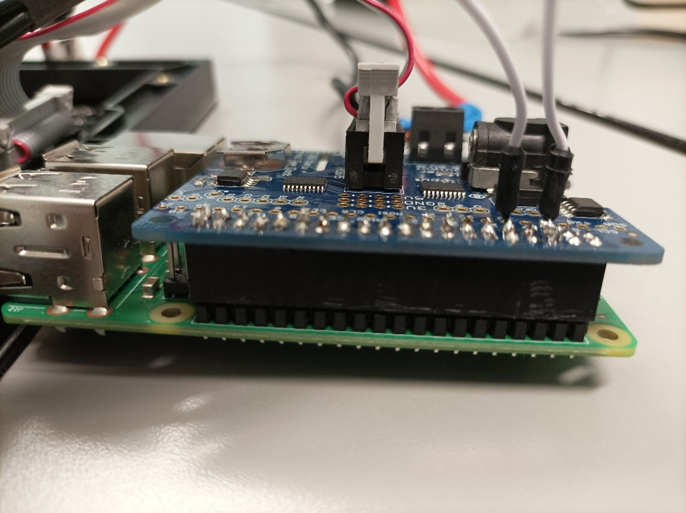

# Sommaire <!-- omit in toc -->

- [Matrice de 32x32 LED et Raspberry Pi](#matrice-de-32x32-led-et-raspberry-pi)

# 1. Matrice de 32x32 LED et Raspberry Pi

Ce document a pour but de résumé et expliquer les différentes étapes nécessaires pour utiliser la matrice de LED 32x32 avec un raspberry pi 3.

Matériel nécessaire :
-	Matrice de 32x32 LED <br /> 
 
-	Raspberry pi 3 <br/> 
 
-	RGB Matrix HAT <br/> 
 
-	Jumper wires 
-	Setup de soudure
-	Cable d’alimentation rouge et noir <br/> 
 
-	Cable de donnée 2x8 <br/> 
 
-	Alimentation 5V 4A <br/> 
 
-	Clavier et souris
-	L’alimentation du raspberry pi 3
-	Câble Ethernet 
-	Ecran 
-	Câble HDMI

__**Prérequis**__ : L’OS du raspberry doit être installé.

# Préparation matérielle

Tout d’abord si les éléments de votre RGB matrix HAT ne sont pas installé, ils doivent l’être en étant soudé, faîtes attention à ce que les éléments soient bien dans le bon sens si ce n’est pas le cas alors ils doivent être dessoudés puis ressouder dans le bon sens.
En ce qui concerne le branchement de la matrice de LED, prenez votre matrice de LED comme sur
l’image ci-dessous :


 
Ensuite branchez votre câble d’alimentation comme ceci :


 
Puis branchez votre câble de donnée :


 
Après cela les extrémités de ces 2 câble doivent être reliés au HAT comme ceci (pour le câble
d’alimentation le câble noir va dans la fente négative et le rouge dans la fente positive) :


 
Quand tout cela est fait vous devez maintenant connecter le HAT au raspberry pi :

 


 
Quand tout cela est fait vous pouvez brancher la souris, le clavier, le câble internet, le câble HDMI, ainsi que brancher le HAT avec l’alimentation 5V 4A et enfin branchez le raspberry pi afin de l’allumer :
 


# Installation et configuration des dépendances pour la matrice de LED 
Sur le bureau vous allez créer un nouveau dossier que vous pouvez appeler « LEDMatrix ».

Ouvrez un nouveau terminal et entrer les commandes suivantes une par une :
-	`cd Desktop/LEDMatrix ` 
-	`curl https://raw.githubusercontent.com/adafruit/Raspberry-Pi-Installer-Scripts/master/rgb-matrix.sh >rgb-matrix.sh`
-	`sudo bash rgb-matrix.sh`
Vous devriez vous retrouver face cette interface :


 
Continuer l’installation en rentrant y.
Il vous demande maintenant le module que vous utilisez, choisissez 2 :


 
Rentrer y pour le support de temps.

Ici le choix s’offre à vous pouvez décider de choisir l’option « convenience », cela diminuera la
qualité de votre matrice de LED mais cette option ne nécessite pas de soudure. Si vous prenez
l’option « quality » vous devrez souder un jumper wire entre le GPIO 4 et GPIO 18 du HAT et le son
de votre raspberry pi sera désactiver néanmoins l’affichage de la matrice de LED sera de meilleure
qualité :


 
Enfin pour les deux autres fois où le programme vous demandera de continuer rentrer y.

Un dossier nommé « rpi-rgb-led-matrix » est apparu dans votre dossier. Ce dossier contient tout ce qu’il faut pour manipuler la matrice de LED. Le dossier qui nous intéresse est celui qui contient les dépendances et exemples Python. Aller dans le dossier bindings -> python -> samples. Ce dernier dossier contient les exemples Python que vous pouvez faire fonctionner, pour cela quand vous ouvrez un nouveau terminal rentrez :
-	```console 
    cd Desktop/LEDMatrix/rpi-rgb-led-matrix/bindings/python/samples
    ```
-	```console
    sudo python3 <LeNomDuScriptPython>
    ```

Exemple : 
```bash 
sudo python3 rotating-block-generator.py
```
Quand vous lancez un script vous pouvez le stopper en appuyant sur Ctrl+C.
Quand vous lancer un script il se peut que les LEDs clignotent et glitch dans ce cas là il faut aller dans le dossier de configurationdu raspberry pour modifier un paramètre. Ouvrez un nouveau terminal et rentrez :
-	```console
    sudo nano ../../boot/config.txt
    ```
Vous êtes maintenant dans le fichier de configuration, en vous déplaçant avec les flèches directionnelles cherchez arm_freq ou core_freq si aucun des deux n’est présent choisissez un endroit dans le fichier et ajouter les lignes :
-	`arm_freq=700`
-	`core_freq=200`

Si ces deux paramètres sont déjà présents, modifiez-les en conséquence. Après cela appuyer sur Ctrl+X -> y -> Entrer. Quand tout cela est fait rentrez dans votre terminal : 
-	```console
    sudo rebbot now
    ``` 
Pour redémarrer le raspberry pi et appliquer les changements. Noter que si les LEDs glitchent encore
vous pouvez descendre le paramètre core_freq à 150 mais c’est une limite à ne pas dépasser.

Une dernière précision si vous remarquez que toutes les couleurs ne s’affichent pas comme elles devraient le faire alors c’est peut-être parce que vous avez une alimentation pour le HAT de 5V et 2A or c’est une alimentation 5V 4A qu’il faut avoir.
Voilà la matrice de LED doit pouvoir fonctionner !

# Scripts supplémentaires 
En plus des exemples qui sont proposés par défaut, j’ai créé des scripts qui vont vous permettre
d’afficher une couleur voulue, une image, un gif mais aussi un script complet à faire tourner en
boucle. Les scripts sont disponibles
[ici](https://drive.google.com/drive/folders/19rWd4vAzERYttmPGQWuKG9r8jbHmDWCJ?usp=sharing).

Notez que ce drive contient également un dossier gif que vous devez utilisez si vous voulez les exemples de base de la majorité des scripts. Il est fortement conseillé de placer ces différents éléments au même endroit où les exemples de base sont placer.  
Vous avez donc : 
-	<u>color-viewer.py</u> : permet de visualiser une couleur via son code RGB sur toute la matrice de LED ou sur un petit carré de 2x2 pixels.

-	<u>imageLED.py</u> : permet de visualiser une image sur la matrice de LED, si l’image choisit à
une taille inférieure ou égale 32x32 elle s’affichera normalement si ce n’est pas le cas la matrice
affichera le haut gauche de l’image choisit. Pour choisir une image il faut ajouter le paramètre «
-i CheminDeVotreImage/NomDeVotreImage » à la suite de la commande de base, exemple : 
    ```console
    sudo python3 imageLED.py -i Desktop/image/monImage.png
    ```

-	<u>gif-viewer.py</u> : permet de visualiser un gif ou plus précisément une suite d’image qui obéis aux mêmes règles de grandeur que imageLED.py. Pour afficher un gif, il faut que vous ayez un dossier contenant toutes les images de votre gif et toutes ces images doivent avoir un nom similaire de la forme : nomDeVotreImage_X.png. Par exemple si mon gif monGif est composé de 3 images alors ces 3 images s’appelleraient : monGif_1.png, monGif_2.png, monGif_3.png. Si toutes vos images ne respectent pas une règle de nomination le script ne fonctionnera pas. Vous pouvez ajouter 3 paramètres à ce script « -d CheminDuDossierDeVotreGif » qui permet de choisir un dossier qui contient les images du gif, « -s UneValeurNumerique » qui permet de choisir l’intervalle de temps entre chaque image (0.2 par défaut), « -l 0ou1 » qui permet de choisir si la suite d’image doit se jouer en boucle ou non (par défaut 0 : pas de boucle) et « -i ValeurNumeriqueEntiere » qui permet de choisir le nombre d’itération d’un gif (par défaut 1).

-	<u>default.py</u> : Script complet qui joue plusieurs gifs à la suite grâce au dossier gif. Sur le model pré-fait ce script se lance quand vous branchez le raspberry pi si vous voulez que ce ne soit plus le cas ouvrez un nouveau terminal est rentrez la commande : sudo crontab -e 
Vous êtes maintenant sur le fichier crontab, tout en bas du fichier vous avez une ligne qui
ressemble à :` @reboot sh /home/pi/default.sh` <br>
Vous pouvez la commenter en insérant un # au début de la ligne ou tout simplement en la supprimant. Pour quitter l’éditeur de texte appuyez sur Ctrl+X -> y -> Entrer.

Si vous voulez qu’un script se lance au démarrage de votre raspberry pi, allez dans votre home raspberry pi et créez un fichier bash dans lequel vous écrirez :
```console
#!/bin/bash
cd /LeCheminDeVotreDossierD’ExpemplesPython/
sudo python3 VotreScriptPython.py
```
Ensuite allez dans un nouveau terminal et rentrez : `sudo crontab -e`

A la fin du fichier marquez : 
```console
@reboot sh /LeCheminDeVotreFichierBash/VotreFichierBash.sh
```
Pour quitter l’éditeur de texte appuyez sur Ctrl+X -> y -> Entrer.

