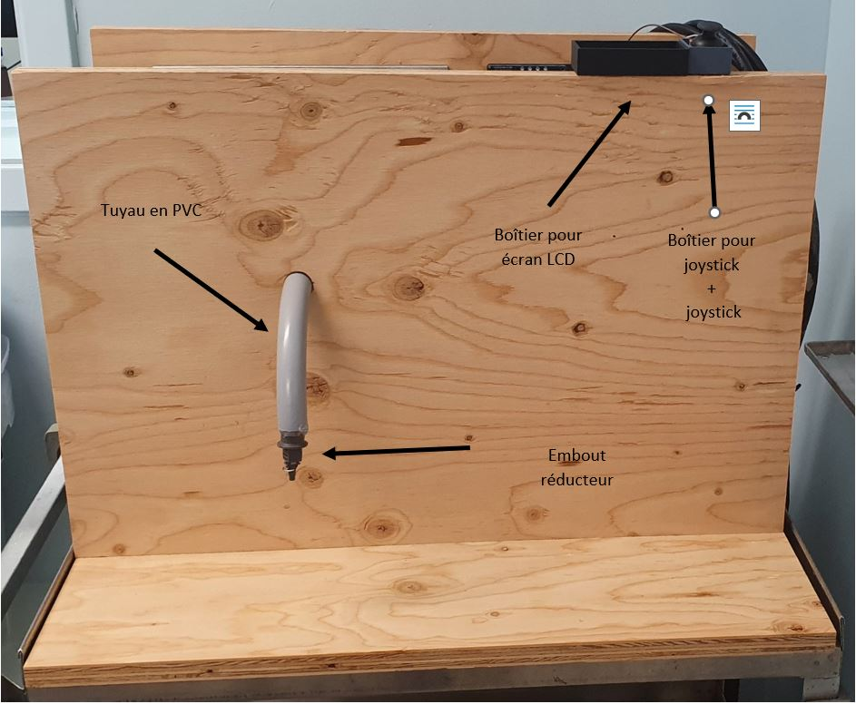
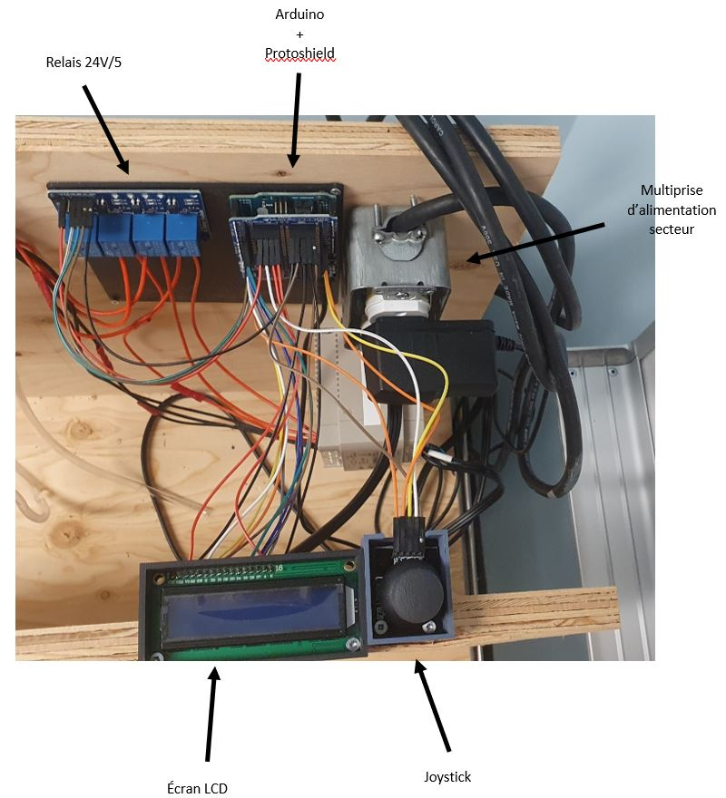
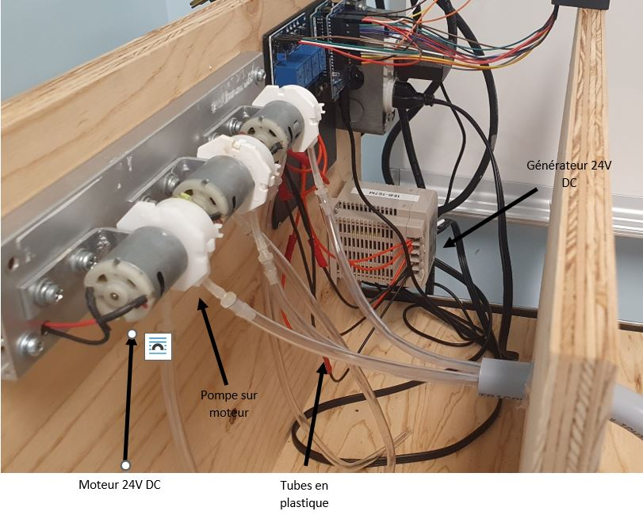
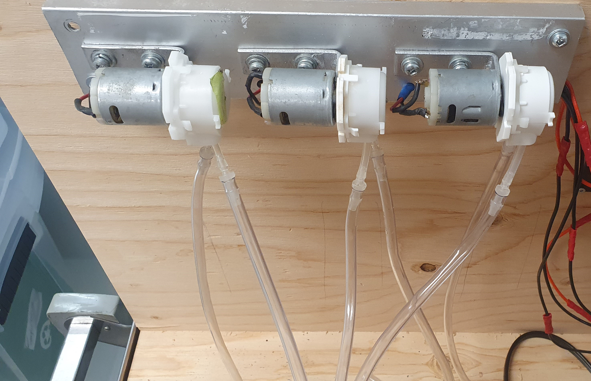
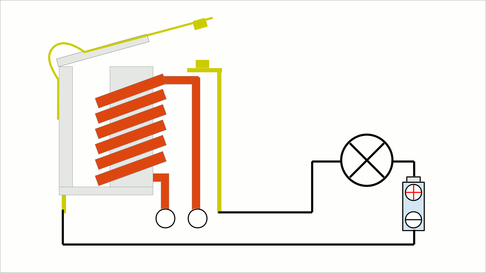
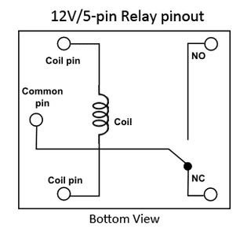
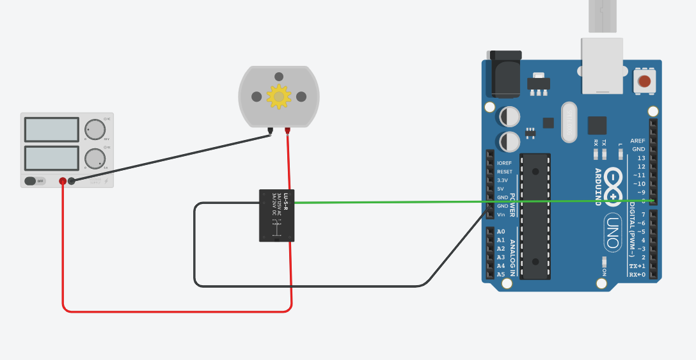
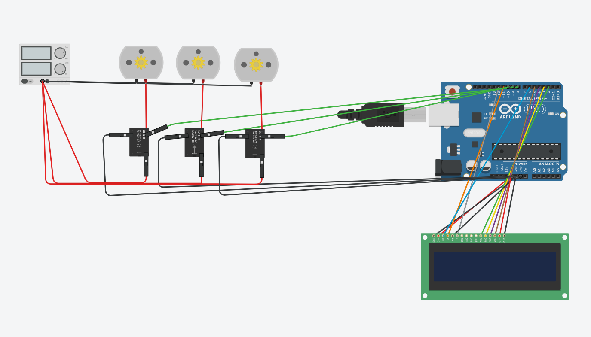

# Sommaire <!-- omit in toc -->

- [1. Matériaux](#1-matériaux)
- [2. Utilisation](#2-utilisation)
  - [2.1. Fonctionnalités](#21-fonctionnalités)
  - [2.2. Programme](#22-programme)
- [3. Montage électrique](#3-montage-électrique)
  - [3.1. Fonctionnement d'un relais](#31-fonctionnement-dun-relais)
  - [3.2. Montage électrique](#32-montage-électrique)
- [4. Possibilités d'amélioration](#4-possibilités-damélioration)
  - [4.1. Partie physique](#41-partie-physique)
  - [Partie programmation](#partie-programmation)

# 1. Matériaux
Voici la liste des matériaux que nous avons utilisé pour créer notre machine à cocktail :
- Un Arduino Uno
- Une plaque d’extension  Arduino
- Un écran LCD 16x2
- Un joystick
- Une plaque de 4 relais 5V
- Un générateur 24V DC
- Trois moteurs 24V
- Trois systèmes de pompes
- Un support pour les moteurs
- Une prise de secteur 120V
- Des tubes en plastique
- Un tuyau en PVC
- Un embout pour diminuer la taille de la sortie du tuyau
- Trois planches de bois 60x40cm
- Des vis en fonction

Voici des photos de la machine : 

Avant de la machine  

Côté droit de la machine 

Côté gauche de la machine 

Moteurs vus de face 

# 2. Utilisation
## 2.1. Fonctionnalités
La machine dispose d'un menu vous permettant de choisir entre 4 options :
- Cocktail avec alcool (un des moteur tournera bien moins longtemps que les autres)
- Cocktail sans alcool (à peu près le même temps pour tous les moteurs)
- Purge de la machine (fait tourner les 3 moteurs 30 secondes un par un)
- Création cocktail (permet de créer votre propre cocktail)

Ces fonctions sont accessibles à partir du menu affiché sur l'écran LCD et contrôlable verticalement
avec le joystick.  
Le menu de création de cocktail permet un déplacement horizontal pour sélectionner
le moteur et un déplacement vertical pour la quantité.  
Une pression sur le joystick permet de confirmer son choix.

## 2.2. Programme
La partie technique du programme se trouve dans le header
[GestionMenu.h](https://github.com/MoOaAaa/StageFabLab/blob/main/Machine%20a%20cocktail/Creation%20Cocktail/lib/Cocktails/GestionMenu.h),
et est utilisé pour gérer l'entièreté de la machine. Les fonctions citées dans
[2.1.](#21-fonctionnalités) se trouvent dans l'ordre aux lignes :
- [382 - FonctionCocktailAlcool()](https://github.com/MoOaAaa/StageFabLab/blob/main/Machine%20a%20cocktail/Creation%20Cocktail/lib/Cocktails/GestionMenu.h#L382)
- [400 - FonctionCocktailSansAlcool()](https://github.com/MoOaAaa/StageFabLab/blob/main/Machine%20a%20cocktail/Creation%20Cocktail/lib/Cocktails/GestionMenu.h#L400)
- [420 - FonctionPurger()](https://github.com/MoOaAaa/StageFabLab/blob/main/Machine%20a%20cocktail/Creation%20Cocktail/lib/Cocktails/GestionMenu.h#L420)
- [316 - lancementCreation()](https://github.com/MoOaAaa/StageFabLab/blob/main/Machine%20a%20cocktail/Creation%20Cocktail/lib/Cocktails/GestionMenu.h#L316)

# 3. Montage électrique
## 3.1. Fonctionnement d'un relais
Un relais permet de contrôler des appareils demandant un fort courant électrique via un plus faible
courant électrique. Les relais sont comme des interrupteurs mais activés par de l'électricité.

Dans notre cas, les relais nous permettent de contrôler des moteurs 24V DC grâce à un arduino qui ne
délivre que du 5V DC.

Les relais existent sous plusieurs formes, mais les relais que nous utilisons sont des relais à 5
pins comme celui-ci :

Les bornes NO et NC du relais veulent dire "Normally Open" et "Normally Closed". C'est grâce à ces
deux bornes que l'on va pouvoir choisir l'état de l'appareil relié au relais lorsque ce dernier
n'est pas activé. La résistance est reliée à notre contrôleur, dans notre cas les pins digitales de
l'arduino ainsi que sa terre. La borne "Common pin" est reliée au positif de notre source d'énergie
haute-tension.
 
Voici un circuit avec un seul moteur et un relais contrôlé par un Arduino :

## 3.2. Montage électrique
Pour notre circuit complet nous devons rajouter un écran LCD ainsi qu'un joystick d'où l'utilité du
[protoshield](https://www.adafruit.com/product/51) nous permettant d'obtenir beaucoup plus d'accès
au courant que l'arduino délivre. 
Voici un exemple des branchements des trois moteurs ainsi que de l'écran LCD :

# 4. Possibilités d'amélioration
## 4.1. Partie physique
Le montage de notre machine s'est faite uniquement avec des matériaux de récupération,ce qui laisse
beaucoup de possibilités d'amélioration techniques. Bien entendu la machine à quelques défauts car
nous ne sommes "que" des informaticiens donc nous n'avons pas pensé à tout.

Voici donc une liste des améliorations liées au matériel que nous pourrions ajouter :

* Un écran LCD plus grand **ou** un écran tactile
* Un système anti-retour pour éviter que le liquide déborde du tube PVC lorsqu'il y a un trop gros débit
* Des pompes plus performantes
* Un autre support pour l'écran et le joystick
* Un design peut-être plus efficace et permettant d'acceuillir de plus grands verres
* Plus de pompes pour ne pas avoir à changer les bouteilles trop souvent
* Un Arduino Leonardo ou Due
* Capteurs pour voir si le verre est en place ou si des bouteilles sont présentes

## Partie programmation
Le programme que nous avons créé fonctionne bien mais peut être sujet à des améliorations.

Voici les pistes possibles :

* Meilleure gestion de la mémoire si on veut rajouter des cocktails
* Possibilité de créer une pseudo base de données pour n'afficher que les cocktails disponibles avec
  les bouteilles en place.
* Gestion plus poussée de la quantité de boisson délivrée
* Gestion des capteurs évoqués plus haut